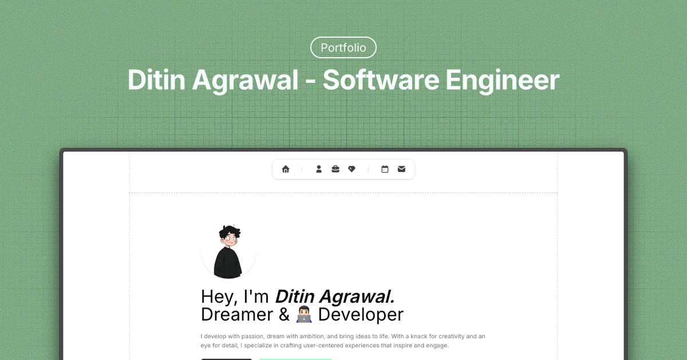

# Portfolio - Ditin Agrawal



A modern, responsive portfolio website built with Next.js 15, showcasing my work as a Software Engineer and Full Stack Developer. This portfolio features a clean design with smooth animations, comprehensive sections including projects, services, testimonials, contact information, and a fully-featured blog powered by MDX.

## 🚀 Live Demo

Visit the live portfolio at: [https://portfolio.ditin.in](https://portfolio.ditin.in)

## ✨ Features

### Portfolio Features

- **Modern Design**: Clean, professional layout with smooth animations
- **Responsive**: Fully responsive design that works on all devices
- **Performance Optimized**: Built with Next.js 15 App Router for optimal performance
- **SEO Optimized**: Complete meta tags, Open Graph, and Twitter Card support
- **Interactive Components**: Smooth animations and transitions using Motion
- **Contact Form**: Functional contact form with API endpoint for inquiries
- **Project Showcase**: Detailed project presentations with live links
- **Services Section**: Comprehensive overview of offered services
- **Testimonials**: Client feedback and recommendations
- **Social Links**: Easy access to professional social media profiles

### Blog Features

- **MDX-Powered Blog**: Write blog posts in MDX with React components
- **Syntax Highlighting**: Beautiful code blocks with syntax highlighting
- **Table of Contents**: Auto-generated TOC for long articles
- **Reading Progress**: Visual reading progress indicator
- **Author Cards**: Rich author information display
- **Tag System**: Organize posts with tags and filtering
- **Mobile-Optimized**: Mobile-friendly reading experience
- **Share Functionality**: Easy social sharing for blog posts

## 🛠️ Tech Stack

### Core Framework

- **Framework**: Next.js 15 (App Router)
- **Language**: TypeScript
- **Runtime**: React 19

### Styling & UI

- **Styling**: Tailwind CSS 4 with PostCSS
- **UI Components**: Radix UI primitives
- **Icons**: Tabler Icons & Lucide React
- **Animations**: Motion (Framer Motion successor)

### Content Management

- **Blog Engine**: Fumadocs MDX
- **Content Format**: MDX with React components
- **Typography**: Tailwind Typography plugin

### Development Tools

- **Package Manager**: Bun
- **Linting**: ESLint 9 with Next.js config
- **Code Formatting**: Prettier with Tailwind plugin
- **Validation**: Zod for type-safe schemas

## 📁 Project Structure

```
portfolio/
├── app/                    # Next.js app directory (App Router)
│   ├── api/               # API routes
│   │   └── send-msg/      # Contact form submission endpoint
│   ├── blog/              # Blog section
│   │   ├── [slug]/        # Dynamic blog post pages
│   │   ├── layout.tsx     # Blog layout with sidebar
│   │   ├── metadata.ts    # Blog metadata configuration
│   │   └── page.tsx       # Blog listing page
│   ├── globals.css        # Global styles and CSS variables
│   ├── layout.tsx         # Root layout with metadata
│   ├── page.tsx          # Home page
│   └── favicon.ico       # Site favicon
├── components/            # React components
│   ├── blog/             # Blog-specific components
│   │   ├── author-card.tsx        # Author information display
│   │   ├── blog-card.tsx          # Blog post preview cards
│   │   ├── footer.tsx             # Blog footer
│   │   ├── hash-scroll-handler.tsx # URL hash navigation
│   │   ├── mobile-toc.tsx         # Mobile table of contents
│   │   ├── navbar.tsx             # Blog navigation
│   │   ├── promo-content.tsx      # Promotional content
│   │   ├── read-more-section.tsx  # Related posts section
│   │   ├── table-of-contents.tsx  # Desktop TOC
│   │   └── tag-filter.tsx         # Tag filtering system
│   ├── home/             # Portfolio page sections
│   │   ├── about/        # About section
│   │   ├── contact/      # Contact form with validation
│   │   ├── experience/   # Experience timeline
│   │   ├── footer/       # Portfolio footer
│   │   ├── hero/         # Hero section with animations
│   │   ├── navbar/       # Main navigation
│   │   ├── projects/     # Projects showcase
│   │   ├── services/     # Services offered
│   │   ├── testimonials/ # Client testimonials
│   │   └── icons.tsx     # Custom icons
│   ├── mdx/              # MDX-specific components
│   │   ├── author-card.tsx   # MDX author card
│   │   ├── copy-header.tsx   # Copy-to-clipboard headers
│   │   └── media-viewer.tsx  # Image/media viewer
│   └── ui/               # Reusable UI components (Radix-based)
│       ├── accordion.tsx  # Collapsible content
│       ├── button.tsx     # Button variants
│       ├── card.tsx       # Card layouts
│       ├── drawer.tsx     # Mobile drawer
│       ├── input.tsx      # Form inputs
│       ├── separator.tsx  # Divider lines
│       ├── slider.tsx     # Range sliders
│       ├── textarea.tsx   # Text areas
│       └── tooltip.tsx    # Hover tooltips
├── content/              # Content management
│   └── blog/            # Blog posts in MDX format
├── lib/                  # Utility functions and configurations
│   ├── authors.ts       # Author data and schemas
│   ├── site.ts          # Site configuration
│   └── utils.ts         # Helper functions
├── public/               # Static assets
│   ├── assets/          # Project and service images
│   ├── fonts/           # Custom font files
│   ├── thumbnails/      # Blog post thumbnails
│   ├── avatar.jpg       # Profile picture
│   ├── og.webp          # Open Graph image
│   └── msg-sent.svg     # Contact form success icon
├── mdx-components.tsx    # Global MDX component mapping
├── source.config.ts      # Fumadocs configuration
└── package.json         # Dependencies and scripts
```

## 🚀 Getting Started

### Prerequisites

- Node.js 18+ or Bun
- Git

### Installation

1. **Clone the repository**

   ```bash
   git clone https://github.com/ditinagrawal/portfolio.git
   cd portfolio
   ```

2. **Install dependencies**

   ```bash
   # Using Bun (recommended)
   bun install

   # Or using npm
   npm install
   ```

3. **Run the development server**

   ```bash
   # Using Bun
   bun dev

   # Or using npm
   npm run dev
   ```

4. **Open your browser**
   Navigate to [http://localhost:3000](http://localhost:3000) to see the portfolio.

## 📝 Customization

### Personal Information

Update the following files with your information:

#### Portfolio Content

- `app/layout.tsx` - Update metadata, title, and description
- `lib/site.ts` - Update site configuration and URLs
- `components/home/about/index.tsx` - Update about section content
- `components/home/experience/index.tsx` - Update work experience
- `components/home/projects/projects.json` - Add your projects
- `components/home/services/services.json` - Update services offered
- `components/home/testimonials/testimonials.json` - Add client testimonials
- `public/avatar.jpg` - Replace with your profile picture
- `public/og.webp` - Update Open Graph image

#### Blog Content

- `content/blog/` - Add your blog posts in MDX format
- `lib/authors.ts` - Update author information
- `app/blog/metadata.ts` - Configure blog metadata
- `source.config.ts` - Configure Fumadocs settings

### Styling

- Modify `app/globals.css` for global styles and CSS variables
- Update Tailwind classes in components for custom styling
- Customize colors and themes in `tailwind.config.js`
- Modify component styles in `components/ui/` for design system changes

### Content Management

#### Portfolio Content

All portfolio content is managed through JSON files in the respective component directories, making it easy to update without touching the code.

#### Blog Content

Blog posts are written in MDX format in the `content/blog/` directory. Each post supports:

- **Frontmatter**: Metadata like title, description, date, tags
- **MDX Components**: Custom React components within blog posts
- **Code Highlighting**: Automatic syntax highlighting for code blocks
- **Table of Contents**: Auto-generated from headings

#### Adding a New Blog Post

1. Create a new `.mdx` file in `content/blog/`
2. Add frontmatter with required metadata
3. Write your content using MDX syntax
4. Add any images to `public/thumbnails/`

Example frontmatter:

```mdx
---
title: "Your Post Title"
description: "Brief description"
date: "2024-01-01"
tags: ["nextjs", "react"]
thumbnail: "/thumbnails/post-image.webp"
---
```

## 🚀 Deployment

### Vercel (Recommended)

1. Push your code to GitHub
2. Connect your repository to Vercel
3. Deploy with zero configuration

### Other Platforms

The portfolio can be deployed to any platform that supports Next.js:

- Netlify
- Railway
- DigitalOcean App Platform
- AWS Amplify

## 📱 Features

### Performance & SEO

- **Static Site Generation**: Pre-rendered pages for optimal performance
- **Image Optimization**: Next.js automatic image optimization
- **SEO Optimized**: Complete meta tags, structured data, and sitemap
- **Web Vitals**: Optimized for Core Web Vitals scoring
- **Responsive Images**: Automatic responsive image generation

### Developer Experience

- **TypeScript**: Full type safety across the entire codebase
- **Component Library**: Reusable UI components with Radix UI
- **Code Quality**: ESLint and Prettier for consistent code formatting
- **Hot Reload**: Fast development with Hot Module Replacement

## 🔧 Available Scripts

- `bun dev` / `npm run dev` - Start development server
- `bun build` / `npm run build` - Build for production
- `bun start` / `npm start` - Start production server
- `bun lint` / `npm run lint` - Run ESLint for code quality
- `bun install` - Install dependencies and run postinstall script for MDX setup

## 🤝 Contributing

Contributions, issues, and feature requests are welcome! Feel free to check the [issues page](https://github.com/ditinagrawal/portfolio/issues).

## 📞 Contact

**Ditin Agrawal**

- Linktree: [https://ditin.in](https://ditin.in)
- Portfolio: [https://portfolio.ditin.in](https://portfolio.ditin.in)
- Email: [Contact via portfolio](https://portfolio.ditin.in#contact)
- LinkedIn: [Connect with me](https://linkedin.com/in/ditinagrawal)
- Twitter: [@ditinagrawal](https://twitter.com/ditinagrawal)

---

⭐ If you found this portfolio helpful, please give it a star on GitHub!
